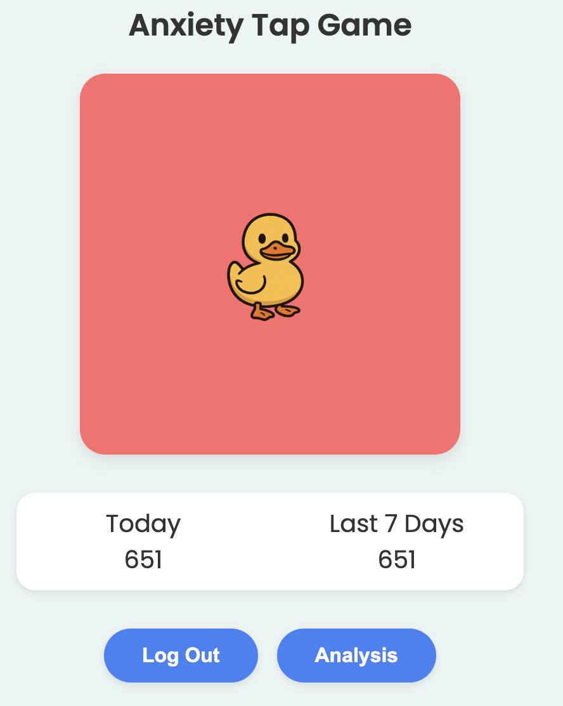
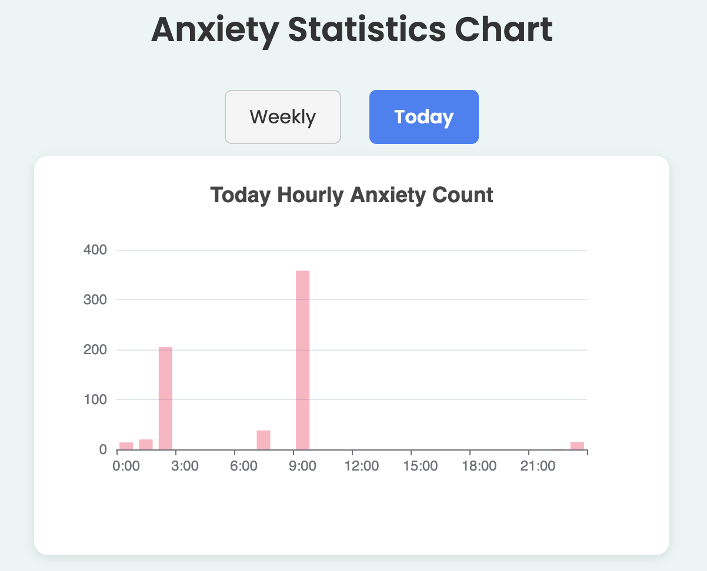
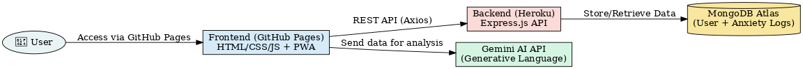

# 🦆 Anxiety Tap Game – Frontend

Anxiety Tap Game is a calming, responsive **Progressive Web App (PWA)** that lets users tap a duck to log moments of anxiety. It provides sound, animation, and visualized feedback to help users become more mindful of their emotional states.

This frontend integrates with a backend API and includes login, registration, offline support, and weekly analytics enhanced by Gemini AI feedback.

> 🔗 **Related Repositories**:
> - 🌐 [Frontend Repo](https://github.com/hogan-tech/StevensQuakHackthonFE)
> - 🧠 [Backend Repo](https://github.com/hogan-tech/StevensQuakHackthon)
> - 🌍 [GitHub Pages (Static Deployment)](https://github.com/hogan-tech/hogan-tech.github.io)


---

## 🌟 Features

- 🎯 **Tap-Based Interaction**  
  Tap the duck to log anxiety moments with sound and animation.

- 🔊 **Simultaneous Quack Sounds**  
  Multiple quick taps trigger overlapping duck sounds for real-time feedback.

- 📈 **Anxiety Analytics**  
  View interactive weekly and daily stats powered by ECharts.

- 🤖 **AI Companion via Gemini**  
  Gemini analyzes anxiety data and offers friendly, supportive insights.

- 📱 **Responsive Web Design**  
  Optimized for all screen sizes with a mobile-first UI.

- 📦 **PWA Support**  
  Add to home screen and use offline with service worker + manifest.

---

## 🚀 Live Demo

🖥️ [Try it Live](https://hogan-tech.github.io)

---

## 🗂️ Folder Structure

```
frontend/
├── index.html            # Main tap-tracking page
├── analytics.html        # Analytics & charting page
├── login.html            # Login form
├── register.html         # Registration form
├── manifest.json         # PWA configuration
├── service-worker.js     # Offline support
├── /images/              # Duck icons and app icons
├── /sounds/              # Quack sound effects
├── /javscript/
│   ├── index.js          # Main interaction logic
│   ├── login.js          # Login logic
│   ├── register.js       # Registration logic
│   └── analysis.js       # Chart and Gemini AI logic
```

---

## 📦 Installation & Usage

### 🧰 Prerequisites

- Node.js (for serving if needed)
- Backend running at:  
  [https://desolate-tor-24628-0ba2463868a2.herokuapp.com](https://desolate-tor-24628-0ba2463868a2.herokuapp.com)

### 📦 Run Locally

1. Clone the repo

```bash
git clone https://github.com/hogan-tech/StevensQuakHackthonFE
cd StevensQuakHackthonFE
```

2. Serve files (e.g., with Live Server or any static server)

---

## 🔐 Auth Flow

- ✅ Login and registration use `localStorage` to store the logged-in user.
- ✅ All analytics and tap events are tied to the current user.
- ✅ Logout clears session and redirects to login.

---

## 📊 Chart Page (analysis.html)

- Switch between **Weekly** and **Today** using tabs.
- Charts are rendered with ECharts.
- Gemini API provides calming, friendly advice based on user anxiety data.

---

## 🛠️ Technologies Used

- **HTML5/CSS3 + Tailwind**
- **JavaScript (Vanilla)**
- **ECharts.js**
- **PWA APIs** (manifest, service worker)
- **Axios & jQuery**
- **Google Gemini API (Generative AI)**

---

## 📱 PWA Support

- Installable on mobile (add to home screen)
- Works offline after initial load
- Custom icons and theme color

---

## 📷 Screenshots

| Home Page 🧠 | Analysis Page 📊 |
|-------------|---------------|
|  |  |

---

## 🌐 Architecture Overview

```plaintext
User 👤
   |
   | 1️⃣ Access PWA via GitHub Pages
   ▼
Frontend (Static SPA)
📍 GitHub Pages (https://hogan-tech.github.io)

   • Built with HTML/CSS/JavaScript (Vanilla + Tailwind)
   • Registers/Login users (via backend API)
   • Tapping interaction: plays sound, animates duck, sends event
   • PWA features: manifest + service worker for offline support
   • Calls Gemini AI for emotional analysis & guidance
   • Fetches daily/weekly stats (chart.html)

   |
   | REST API calls (Axios)
   ▼
Backend Server (Express.js)
📍 Heroku (https://desolate-tor-24628-0ba2463868a2.herokuapp.com)

   • `/users/register` and `/users/login`
   • `/anxiety` logs tap events (timestamped)
   • `/anxiety/today` and `/anxiety/sevenDays` return stats
   • Responses formatted in JSON
   |
   ▼
Database (MongoDB Atlas)
📍 Cloud MongoDB (Remote Cluster)

   • Stores:
     - 🧍 User data (username + hashed password)
     - 🧠 Anxiety event logs (user, day, time)
   • Indexed for date/time performance
```

---

## 🤖 Gemini AI (LLM API)

```
Frontend JavaScript
  └── sends anxiety history to Gemini via fetch()
        ↳ Google Generative Language API (Gemini 2.0 Flash)
              • Returns AI-generated wellness analysis
              • Provides advice, emotional patterns, or praise
```

- Triggered on `chart.html` load or user message input
- Personalized text displayed in `#geminiOutput`

---

## 📊 Data Flow Example

```
[User taps duck] → index.js
  → POST /anxiety
  → MongoDB saves { user, day, time }

[chart.html loads] → fetch /sevenDays or /today
  → fetch data
  → call Gemini API
  → render chart + response
```

---

## 📦 Deployment Overview

| Component     | Platform               | URL / Access                                   |
|---------------|------------------------|------------------------------------------------|
| **Frontend**  | GitHub Pages           | https://hogan-tech.github.io                   |
| **Backend**   | Heroku                 | https://desolate-tor-24628-0ba2463868a2.herokuapp.com |
| **Database**  | MongoDB Atlas          | Secure Cloud Cluster                           |
| **AI Service**| Google Gemini API      | `gemini-2.0-flash` via `fetch()`               |

---

## 🗺️ Diagram



---

## ✨ Notes

- The system supports both real-time interaction (tapping) and delayed analytics (charts + AI)
- It is fully mobile-ready, installable as a PWA, and uses caching for offline access
- Gemini API provides empathetic support based on the user’s stress patterns

---

## ✨ Future Improvements

- 🎨 Theming support (light/dark toggle)
- 🧠 Real-time emotion detection via webcam
- 🌍 Multilingual support
- 🔒 JWT-based secure auth

---

## 👥 Authors

- **Hogan Lin** – [@hogan-tech](https://github.com/hogan-tech)  
- **Gaoyi Wu** – [@Alfred768](https://github.com/Alfred768)  
- **Wesley Kuo** – [@kuowesley](https://github.com/kuowesley)  
- **Yu-An Liao** – [@PeterLikeEat](https://github.com/PeterLikeEat)

---

## 📄 License

This project is licensed under the [MIT License](./LICENSE).

---

### 💬 Feedback Welcome

Feel free to open an issue or suggestion if you’d like to help us improve the user experience.

🧠 Stay calm, and tap on! 🦆